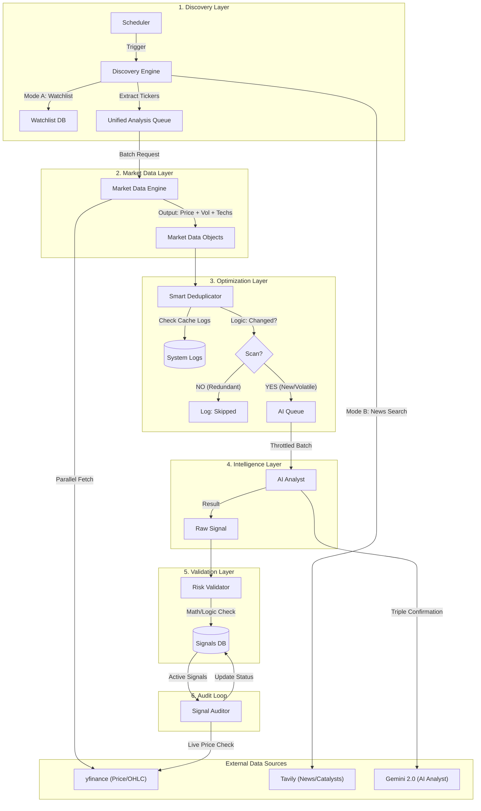

# 🏗️ TradeBrain System Architecture

## 1. System Overview

TradeBrain is a "Headless" Swing Trading System designed as a modular **Scanner Architecture**. It separates the background intelligence (The Engine) from the client-facing delivery (The API).

* **The Engine** (`app/engine/`): Handles data fetching, AI reasoning, risk validation, and auditing.
* **The Face** (`app/api/`): A REST API (FastAPI) that serves signals, manages users, and handles administrative control.

---

## 2. 📊 Data Flow Diagram

---

## 3. 🔄 Core Workflow Logic

The system follows a strict pipeline to ensure only high-quality signals are generated.

### Phase 1: Dual-Mode Discovery

The **Discovery Engine** populates the analysis queue from two sources:

1. **Watchlist Mode:** High-priority scans of user-defined tickers (e.g., TATASTEEL, RELIANCE).
2. **Discovery Mode:** Scrapes breaking news via Tavily to find "stocks in play" (catalyst-driven) that are not yet in the watchlist.

### Phase 2: Parallel Data & Optimization

1. **Market Data Engine:** Uses `asyncio.gather` to fetch OHLC data for 50+ tickers in parallel (preventing timeouts).
2. **Optimization Engine (Gatekeeper):** Checks if the ticker was recently scanned.
* **SKIP:** If price hasn't moved significantly (<0.5%) since last scan.
* **SKIP:** If fundamentals were rejected <24 hours ago.
* **SCAN:** If price surged OR breaking news is detected.

### Phase 3: AI Analysis (Triple Confirmation)

The **AI Analyst** (Gemini) evaluates the setup using three distinct pillars. A trade must pass all three to generate a signal:

1. **Technical:** Trend, Support/Resistance, RSI, MACD.
2. **Fundamental:** P/E Ratio, Debt/Equity, Q-o-Q Growth.
3. **Catalyst:** News events, Earnings, Contracts, Insider Buying.

### Phase 4: Risk Validation ("The Math Police")

The **Risk Validator** performs deterministic checks on the AI's output:

* **Logic:** Stop Loss < Entry < Target (for BUY).
* **Risk/Reward:** Must be ≥ 1:2.
* **Safety:** Rejects duplicate active signals for the same ticker.
* **Context:** Flags trades as `PENDING_REVIEW` if valid but high-risk (e.g., earnings tomorrow).

### Phase 5: The Audit Loop ("The Truth")

Running every 30 minutes during market hours, the **Signal Auditor**:

* Checks all `ACTIVE` signals against live prices.
* Updates status to `HIT_TARGET` (Win) or `HIT_STOP_LOSS` (Loss).
* Triggers notifications for users.

---

## 4. 🏛️ Application Architecture

### Directory Structure & Responsibilities

| Layer | Directory | Responsibility | Dependencies |
| --- | --- | --- | --- |
| **API** | `app/api/v1/` | REST Endpoints, Request Validation, Auth Middleware. | Services, Schemas |
| **Service** | `app/services/` | Business Logic, Orchestration of Repos & Engines. | Repos, Models |
| **Engine** | `app/engine/` | **Background Intelligence:** Scanner, Validator, Auditor. | External APIs |
| **Repository** | `app/repositories/` | Database Abstraction (CRUD). | Models, DB Session |
| **Model** | `app/models/` | SQLAlchemy Database Schemas. | SQLAlchemy |
| **Core** | `app/core/` | Config, Logging, Security, Exceptions. | Libraries |

---

## 5. 📦 Database Schema

### Core Tables

| Table Name | Description | Key Columns |
| --- | --- | --- |
| `users` | User Accounts | `id`, `email`, `role` (ADMIN/USER), `password_hash` |
| `user_sessions` | Device Management | `token`, `device_name`, `is_active`, `expires_at` |
| `signals` | The Predictions | `ticker`, `action`, `entry`, `target`, `stop`, `confidence`, `status`, `setup_type` |
| `scan_logs` | Optimization Cache | `ticker`, `scanned_at`, `result` (PASS/FAIL), `rejection_reason` |
| `user_trades` | Performance Tracker | `signal_id`, `entry_price`, `exit_price`, `pnl`, `status` |
| `watchlist` | Monitored Stocks | `ticker`, `priority`, `added_by` |
| `notifications` | Alerts | `user_id`, `message`, `is_read`, `type` |

---

## 6. 🔐 Security & Deployment

### Security Implementation

* **Authentication:** Stateless JWT (Access Token 15m, Refresh Token 7d).
* **Session Control:** Server-side validation of Refresh Tokens via `user_sessions` table (allows Secure Logout).
* **Passwords:** Bcrypt hashing.
* **RBAC:** Strict separation between `USER` (Read-only) and `ADMIN` (Scanner Control).

### Deployment Strategy

* **Stack:** Python 3.11+, FastAPI, PostgreSQL 15+, Docker.
* **Concurrency:** Uvicorn workers for API; APScheduler for background tasks.
* **Environment:** Configuration via `.env` file (Pydantic Settings).

---

## 7. 📈 Non-Functional Requirements

### Performance

* **Async DB:** All database operations use `SQLAlchemy AsyncIO`.
* **Parallelism:** Market data fetching uses `ThreadPoolExecutor` and `asyncio`.
* **Throttling:** AI requests are rate-limited to respect API quotas.

### Error Handling

* **Global Handler:** Catches exceptions and returns standardized JSON `{"error": "message", "code": 4xx}`.
* **Structured Logging:** JSON-formatted logs for easy parsing (Splunk/Datadog ready).

### Testing

* **Unit Tests:** Mock external APIs (Gemini, yfinance) to test logic.
* **Integration Tests:** Use a test database to verify Repository/Service layers.