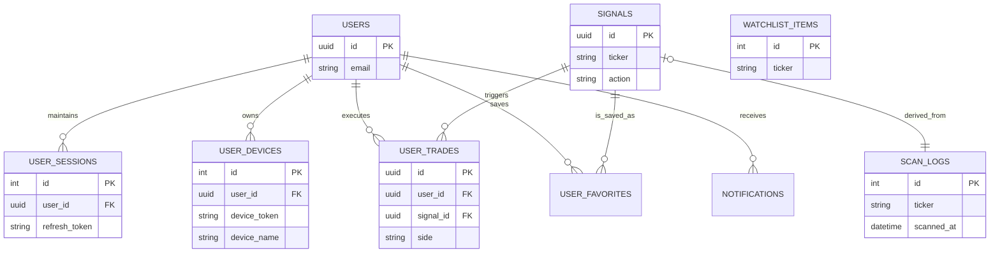

# 📊 TradeBrain Domain Models

This document defines the database schema and relationships for the TradeBrain system. It serves as the single source of truth for database migrations and ORM definitions.

---

## 1. Authentication & Identity Module

### **User** (`users`)
The central identity entity.
- **`id`** (UUID, PK): Auto-incrementing ID.
- **`email`** (String, Unique, Index): User email for login.
- **`password_hash`** (String): Bcrypt hashed password.
- **`full_name`** (String): Display name.
- **`role`** (Enum): `ADMIN` or `USER`.
- **`is_active`** (Boolean): Soft deletion/ban flag.
- **`created_at`** (DateTime): Timestamp.
- **`updated_at`** (DateTime): Timestamp.

### **UserSession** (`user_sessions`)
Manages active JWT refresh tokens for secure logout.
- **`id`** (Integer, PK): Auto-incrementing ID.
- **`user_id`** (UUID, FK → `users.id`): Owner.
- **`refresh_token`** (String, Unique, Index): The actual token string.
- **`user_agent`** (String, Nullable): Browser/Device signature (e.g., "Mozilla/5.0...").
- **`ip_address`** (String, Nullable): Last known IP.
- **`expires_at`** (DateTime): Absolute expiry of the session.
- **`created_at`** (DateTime): Timestamp.

### **UserDevice** (`user_devices`)
Stores FCM/APNS tokens for Push Notifications (Long-lived).
- **`id`** (Integer, PK): Auto-incrementing ID.
- **`user_id`** (UUID, FK → `users.id`): Owner.
- **`device_token`** (String, Unique, Index): The FCM/APNS/Push provider token.
- **`platform`** (Enum): `IOS`, `ANDROID`, `WEB`.
- **`device_name`** (String, Nullable): Friendly name (e.g., "John's iPhone").
- **`is_active`** (Boolean): Toggle to enable/disable notifications for this device.
- **`last_active_at`** (DateTime): Last time the app was opened on this device.

---

## 2. Intelligence Engine Module (The "Brain")

### **Signal** (`signals`)
The core output of the AI Analyst.
- **`id`** (UUID, PK): Unique identifier.
- **`ticker`** (String, Index): Symbol (e.g., "TATASTEEL").
- **`action`** (Enum): `BUY`, `SELL`.
- **`status`** (Enum, Index): `PENDING`, `ACTIVE`, `HIT_TARGET`, `HIT_STOP_LOSS`, `TIMED_OUT`, `EXPIRED`, `MANUAL_CLOSE`.
- **`setup_type`** (Enum): `BREAKOUT`, `PULLBACK`, `REVERSAL`, etc.
- **`confidence`** (Integer): 0-100 score.
- **`entry_price`** (Float): Recommended entry.
- **`target_price`** (Float): Goal.
- **`stop_loss`** (Float): Risk exit.
- **`risk_reward_ratio`** (Float): Calculated field.
- **`time_horizon`** (String): AI prediction (e.g., "3-5 Days").
- **`reasoning`** (Text): Full AI analysis explanation.
- **`warning_flags`** (JSON): Array of risk tags (e.g., `["earnings_tomorrow"]`).
- **`created_at`** (DateTime): Timestamp.
- **`updated_at`** (DateTime): Timestamp.

### **ScanLog** (`scan_logs`)
The "Gatekeeper" cache to prevent redundant AI scanning.
- **`id`** (BigInteger, PK): Auto-incrementing ID (BigInt for high volume).
- **`ticker`** (String, Index): The stock checked.
- **`scanned_at`** (DateTime): When the check occurred.
- **`price_at_scan`** (Float): Market price during scan.
- **`result`** (String): `SCANNED` (AI ran) or `SKIPPED` (Optimization blocked it).
- **`skip_reason`** (String, Nullable): Why it was skipped (e.g., "Price change < 0.5%").

### **Watchlist** (`watchlist_items`)
The priority queue for the scanner.
- **`id`** (Integer, PK): Auto-incrementing ID.
- **`ticker`** (String, Unique, Index): NSE Symbol.
- **`is_active`** (Boolean): Toggle scanning on/off.
- **`priority`** (Integer): 1 (High) to 5 (Low).
- **`sector`** (String, Nullable): Categorization.

---

## 3. User Interaction Module

### **UserTrade** (`user_trades`)
Performance tracker for Paper Trading (User's personal journal).
- **`id`** (UUID, PK): Unique identifier.
- **`user_id`** (UUID, FK → `users.id`): Owner.
- **`signal_id`** (UUID, FK → `signals.id`, Nullable): Linked signal (if applicable).
- **`ticker`** (String): Ticker symbol.
- **`side`** (Enum): `BUY` or `SELL`.
- **`entry_price`** (Float): Actual entry price.
- **`exit_price`** (Float, Nullable): Actual exit price.
- **`quantity`** (Integer): Number of shares (Default 1).
- **`status`** (Enum): `OPEN`, `CLOSED`.
- **`pnl`** (Float, Nullable): Realized Profit/Loss.
- **`pnl_percentage`** (Float, Nullable): ROI %.
- **`created_at`** (DateTime): Timestamp.

### **UserFavorite** (`user_favorites`)
Bookmarks for signals.
- **`id`** (Integer, PK): Auto-incrementing ID.
- **`user_id`** (UUID, FK → `users.id`): Owner.
- **`signal_id`** (UUID, FK → `signals.id`): The saved signal.
- **`created_at`** (DateTime): Timestamp.

### **Notification** (`notifications`)
In-app alerts log.
- **`id`** (Integer, PK): Auto-incrementing ID.
- **`user_id`** (UUID, FK → `users.id`): Recipient.
- **`type`** (Enum): `NEW_SIGNAL`, `SIGNAL_UPDATE`, `RISK_ALERT`, `SYSTEM`.
- **`title`** (String): Short header.
- **`message`** (Text): Body content.
- **`is_read`** (Boolean): Default `False`.
- **`created_at`** (DateTime): Timestamp.

---

## 4. Entity Relationships

---

## 5. Key Indexes

For performance optimization:

| Table | Column | Purpose |
| --- | --- | --- |
| `users` | `email` | Fast Login |
| `signals` | `status` | Fast auditing (finding ACTIVE signals) |
| `signals` | `ticker` | History lookup |
| `scan_logs` | `ticker` | **Critical:** Optimization Engine lookups |
| `user_sessions` | `refresh_token` | Fast Auth Validation |
| `user_devices` | `device_token` | Preventing duplicate device registrations |
