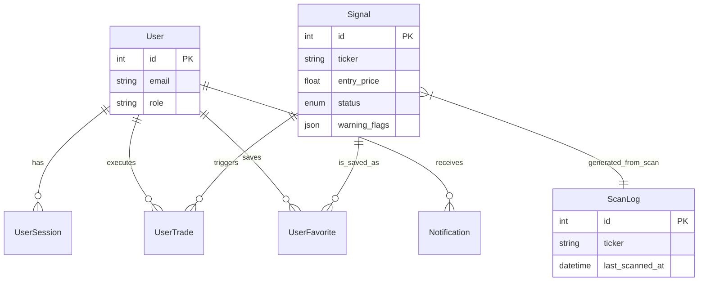

# 🗄️ TradeBrain Database Models

## 1. Authentication Module

### **User** (`users`)

The central identity entity.

* **`id`** (Integer, PK): Auto-incrementing ID.
* **`email`** (String, Unique): Indexed for fast login lookups.
* **`password_hash`** (String): Bcrypt hash.
* **`full_name`** (String): Display name.
* **`role`** (Enum): `ADMIN` (Scanner control) or `USER` (Read-only).
* **`is_active`** (Boolean): Soft deletion/ban flag.
* **`created_at`** (DateTime): Timestamp.

### **UserSession** (`user_sessions`)

Manages active JWT refresh tokens for secure logout and device tracking.

* **`id`** (Integer, PK)
* **`user_id`** (Integer, FK → `users.id`)
* **`refresh_token`** (String, Unique, Index): The token string validation key.
* **`user_agent`** (String): Browser/Device signature (e.g., "iPhone 13").
* **`expires_at`** (DateTime): Absolute expiry of the session.
* **`created_at`** (DateTime)

---

## 2. Intelligence Engine Module (The "Brain")

### **Signal** (`signals`)

The core output of the AI Analyst.

* **`id`** (Integer, PK)
* **`ticker`** (String, Index): Symbol (e.g., "TATASTEEL").
* **`action`** (Enum): `BUY`, `SELL`.
* **`status`** (Enum, Index):
* `PENDING_REVIEW` (Has warnings, needs Admin).
* `ACTIVE` (Live monitoring).
* `HIT_TARGET` (Win).
* `HIT_STOP_LOSS` (Loss).
* `EXPIRED` (Time limit reached).
* `REJECTED` (Failed validation/admin review).

* **`setup_type`** (Enum): `BREAKOUT`, `PULLBACK`, `REVERSAL`.
* **`confidence`** (Integer): 0-100 score.
* **`entry_price`** (Float)
* **`target_price`** (Float)
* **`stop_loss`** (Float)
* **`risk_reward_ratio`** (Float): Calculated field (Target-Entry)/(Entry-Stop).
* **`time_horizon`** (String): AI prediction (e.g., "3-5 Days").
* **`reasoning`** (Text): Full AI analysis.
* **`warning_flags`** (JSON): Array of risk tags (e.g., `["earnings_tomorrow", "low_liquidity"]`).
* **`created_at`** (DateTime)

### **ScanLog** (`scan_logs`)

The memory for the "Optimization Engine" (Layer 3). Used to deduplicate scans and save tokens.

* **`id`** (Integer, PK)
* **`ticker`** (String, Index)
* **`last_scanned_at`** (DateTime): When the AI last looked at this.
* **`price_at_scan`** (Float): Price during that scan.
* **`result`** (Enum): `SCANNED` (AI ran), `SKIPPED` (Optimization Gatekeeper blocked).
* **`skip_reason`** (String): e.g., "Price moved < 0.5%".

### **Watchlist** (`watchlist_items`)

The priority queue for the scanner.

* **`id`** (Integer, PK)
* **`ticker`** (String, Unique, Index)
* **`is_active`** (Boolean): Toggle scanning on/off.
* **`priority`** (Integer): 1 (High) to 5 (Low).
* **`sector`** (String): Optional categorization.

---

## 3. User Interaction Module

### **UserTrade** (`user_trades`)

Performance tracker for Paper Trading.

* **`id`** (Integer, PK)
* **`user_id`** (Integer, FK → `users.id`)
* **`signal_id`** (Integer, FK → `signals.id`, Nullable): Linked signal.
* **`symbol`** (String)
* **`entry_price`** (Float)
* **`exit_price`** (Float, Nullable)
* **`quantity`** (Integer): Default 1.
* **`status`** (Enum): `OPEN`, `CLOSED`.
* **`pnl`** (Float): Realized Profit/Loss.
* **`created_at`** (DateTime)

### **UserFavorite** (`user_favorites`)

Bookmarks for signals.

* **`id`** (Integer, PK)
* **`user_id`** (Integer, FK → `users.id`)
* **`signal_id`** (Integer, FK → `signals.id`)
* **`created_at`** (DateTime)

### **Notification** (`notifications`)

In-app alerts.

* **`id`** (Integer, PK)
* **`user_id`** (Integer, FK → `users.id`)
* **`type`** (Enum): `SIGNAL_ALERT`, `TRADE_UPDATE`, `SYSTEM`.
* **`title`** (String)
* **`message`** (Text)
* **`is_read`** (Boolean): Default `False`.
* **`created_at`** (DateTime)

---

## 4. Entity Relationship Diagram (ERD)

---

## 5. Indexes & Performance Optimization

| Table | Index Column | Purpose |
| --- | --- | --- |
| `signals` | `status` | Faster auditing (finding ACTIVE signals). |
| `signals` | `ticker` | Quick lookups for history. |
| `scan_logs` | `ticker` | Critical for Optimization Engine (Gatekeeper) lookups. |
| `users` | `email` | Fast login/auth. |
| `user_sessions` | `refresh_token` | Fast token validation on API calls. |
| `watchlist_items` | `is_active` | Filtering the daily scan list. |

---

## 6. Validation Rules ("The Math Police")

*Implemented in `app/engine/validator.py` and Pydantic Schemas.*

1. **Risk/Reward:** `(Target - Entry) / (Entry - Stop)` must be **≥ 2.0**.
2. **Logic (BUY):** `Stop Loss < Entry Price < Target Price`.
3. **Consistency:** `current_price` cannot vary >1% from `entry_price` at moment of creation.
4. **No Duplicates:** Cannot create a `BUY` signal for TATASTEEL if an `ACTIVE` one already exists.